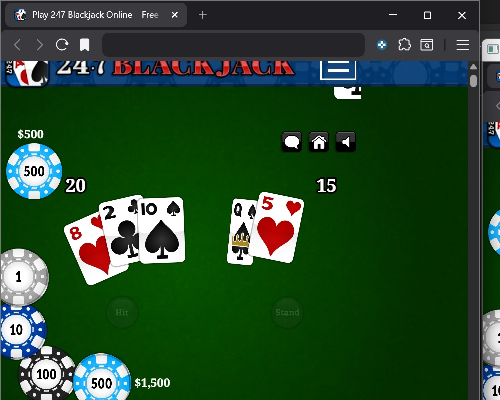

# 🃏 Blackjack Object Detection (WIP)

An End-to-End Computer Vision and Machine Learning pipeline designed to detect and recognize Blackjack cards in real-time.

## 🚀 Project Overview

The project focuses on building a proprietary dataset for high-frequency card detection:
1. Data Collection: Custom screen capture script (data_collector.py).
2. Annotation & Training: Model training using YOLOv11 via Roboflow.
3. Real-Time Inference (WIP): Integration for live game analysis.

## 🧠 Model Training (YOLOv11)

The model was trained on a custom dataset annotated manually. Below is a sample of the detection performance:

## 🛠️ Tech Stack

*   **Python:** Core logic.
*   **OpenCV:** Image processing.
*   **Roboflow & YOLOv11:** For training and detection.

## 💻 How to Collect Data

1. **Install dependencies:**
   pip install opencv-python mss keyboard numpy

2. **Run the collector:**
   python data_collector.py
   
   (Press S to save a frame, Q to quit.)

---
*Developed by Federico Taiola*
